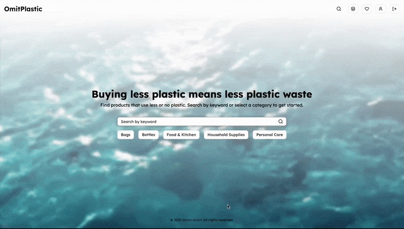
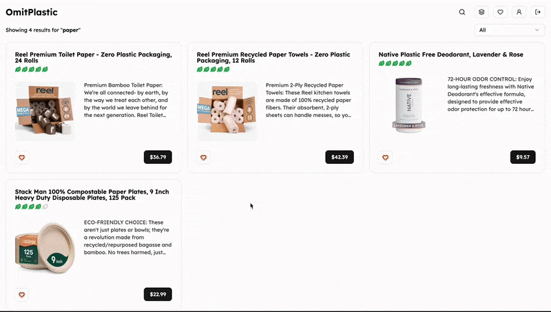
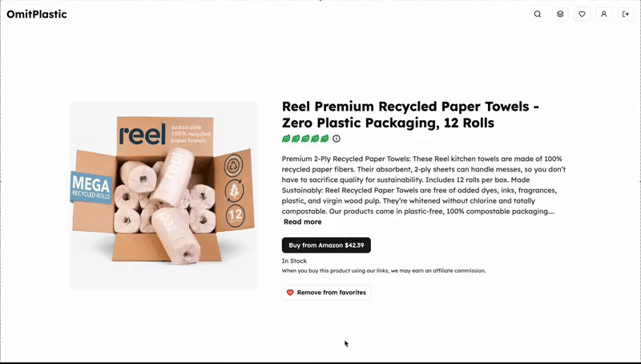

# OmitPlastic

[](https://github.com/gavinmgrant/omitplastic-web/blob/main/LICENSE)

OmitPlastic is a full-stack web app that lists products that are plastic-free or use less plastic to reduce plastic pollution. Users can create an account to favorite products. Product data is synced with Amazon product data via a protected endpoint that calls the Bright Data API in Vercel cron jobs.

## Live App

See a live version of this app here: [www.omitplastic.com](https://www.omitplastic.com/).

## User Flow



* As a user, I want to be able to search for products by keyword or category.



* As a user, I want to be able to view a product detail page and favorite products.



* As a user, I want to be able to view and manage my list of favorite products.

## Technology

* [TypeScript](https://www.typescriptlang.org/) - Strongly typed programming language
* [React](https://reactjs.org/) - JS library for UI
* [Next.js](https://nextjs.org/) - React framework
* [TanStack Query](https://tanstack.com/query/latest/docs/framework/react/overview) - Server state management
* [Tailwind CSS](https://tailwindcss.com/) - Utility-first CSS framework
* [Neon](https://neon.com/) - Serverless Postgres database
* [Neon Auth](https://neon.com/docs/neon-auth/overview) - Authentication and user management
* [Drizzle ORM](https://orm.drizzle.team/) - TypeScript Object-Relational Mapping
* [Bright Data](https://brightdata.com/) - Web scraper APIs 
* [Keystatic](https://keystatic.com/) - Content management system
* [Vercel](https://vercel.com/) - Cloud platform for deployment and cron jobs

## Getting Started

First, install the dependencies and set up the environment variables (see below):

```bash
pnpm install
```

Run the database migrations to create the tables in the Neon database:

```bash
npx drizzle-kit push
```

Then, start the development server to run the app locally:

```bash
pnpm dev
```

## Environmental Variables

```bash
# Neon connection string
DATABASE_URL=

# Neon Auth environment variables for Next.js
NEXT_PUBLIC_STACK_PROJECT_ID=
NEXT_PUBLIC_STACK_PUBLISHABLE_CLIENT_KEY=
STACK_SECRET_SERVER_KEY=

# BrightData environmental variables to scrape Amazon product data
BRIGHTDATA_API_KEY=
BRIGHTDATA_DATASET_ID=

# Secret to protect the sync endpoint from unauthorized requests for Vercel
CRON_SECRET=
```
